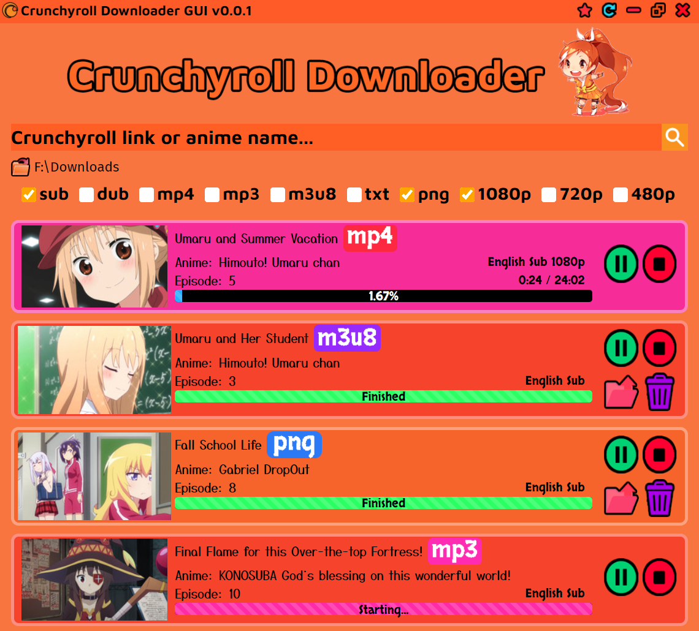

## Crunchyroll Downloader

This is a cute GUI application that lets you download anime episodes from Crunchyroll.

### Features:
- Download anime episodes in mp4 format, and specify a quality (1080p, 720p, 480p, etc.)
- Download just the audio of an episode in mp3 format
- Download the m3u8 playlist (very fast, and still playable with the VLC player)
- Download all of the episode thumbnails in png format
- Download the subtitles of an episode (as a text file)
- Download all of the episodes in a season (detected by the link or if the search query has no numbers)
- If you have a premium account you can login to download premium episodes
- Control the conversion process (pause, resume, stop, delete, etc.)

### Installation

Download the latest exe installer from the [releases](https://github.com/Tenpi/Crunchyroll-Downloader/releases) tab. You may get a warning message along the lines of "running this app can harm your PC", but don't worry because it's safe. Updates are able to be installed automatically.

### Bugs and Requests

You can open an issue on my GitHub repository. I appreciate any requests, but I can't guarantee that I will fulfill all of them.

### Disclaimer

This tool is for personal usage/offline viewing convenience only. If you like anime, then support the industry by buying merch, DVD's, CR premium, etc.